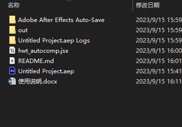
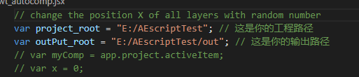
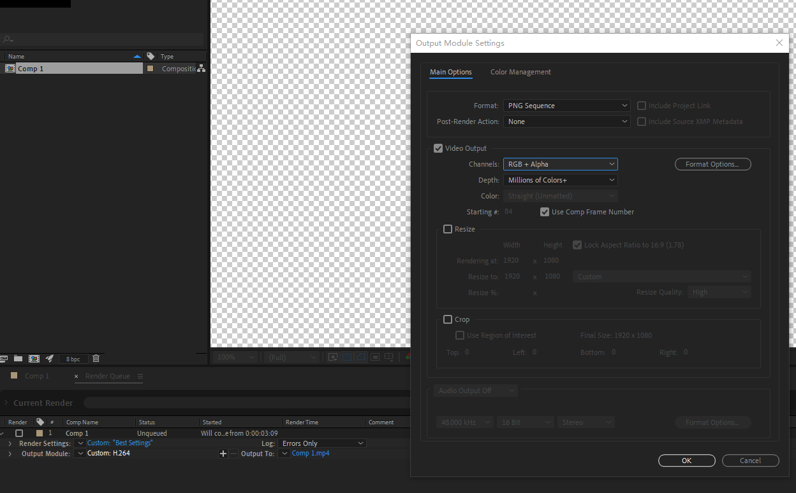
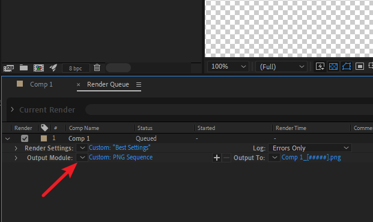
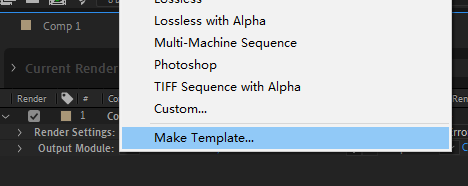
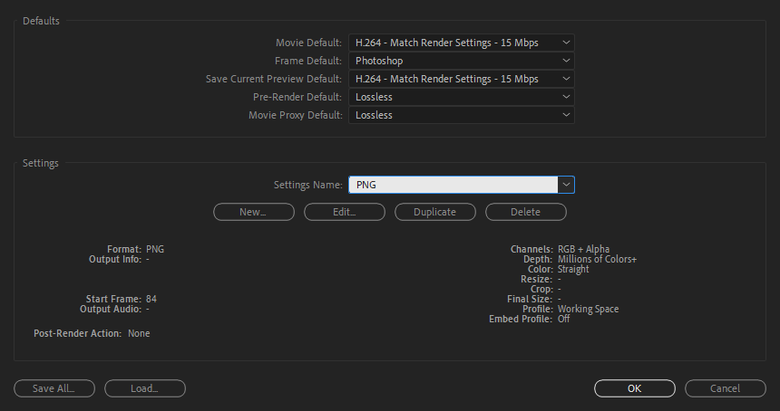
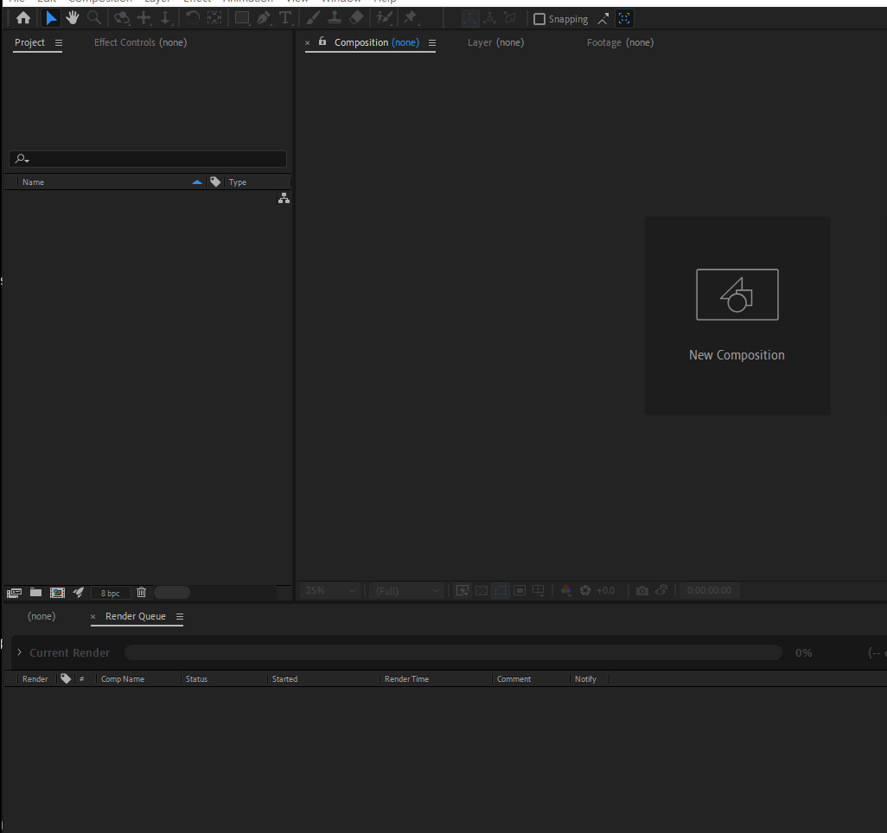

# hwt_autocomp脚本使用详解
>- 脚本名称为hwt_autocomp.jsx
>- 脚本语言为javascript(ExtendScript)
>- 脚本运行环境为after effect 2022+
>- 脚本命令行执行为 cmd : AE_install_path\afterfx.exe –r your_script_path
>- 作者 惠文通
---
***

## 此脚本是用来批量将黑白图作为彩图的通道，输出透明的png图片
* 只支持jpg、png文件
* 黑白通道文件命名须为彩色文件的命名变体 例如 xxx.png 的黑白通道文件的命名应该为 -> xxx_alpha.png
* 图片命名不按照此规范的话则会导致脚本不可用
## 首先脚本需要放在工程根目录(不放也可以，只是为了方便项目管理)

## 需要打开脚本替换路径为你的图片源路径和目标路径（可使用文本文档）


* 注意，路径要为斜杠/，windows系统下复制为反斜杠\
## 然后打开一个AE空工程
* ctrl+n->ctrl+m创建一个渲染序列并设置成PNG的导出格式
* 根据你的项目需求设置好格式后点击OK<br/>


* 点击创建模板<br/>

* 模板命名为大写的PNG（或者HWT）也可以，否则脚本不识别
* 点击OK
* 清空所有内容<br/>

## File->Script->Run Script File执行脚本

* 所有的渲染序列构建完毕后，点击render
* Enjoy it！！！
<!-- ```mermaid
gantt
title sadasd

``` -->