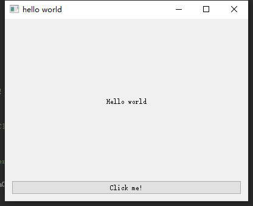

# 环境配置与入门   
第一课，讲述使用Python和PySide2的软件开发环境的配置和显示简单的helloworld界面。

## 软件开发环境  
* Windows10(其他操作系统亦可)
* Python3.6  
* PySide2

## 安装PySide2  
关于Python的安装请自行学习，这里不再累述。  
安装PySide2的PyPI，命令行:  
```bash
pip install pyside2
```   

## Hello world!  
万程开头helloworld!作者编写的的这个helloworld.py是根据官网教程改编的，里面也写了详细的注释。
此方法，只使用编写代码来实现Qt窗口。当我们设计复杂且美观的窗口时，只使用代码来编写必定是非常繁琐的。
因此，在下一讲中，会介绍一种结合QtDesigner的用户界面绘制方法，能让我们更高效的实现QtUI。
当你配置好环境，可以直接运行helloworld.py，如果成功运行并显示如下窗口，那么恭喜你入坑！  
  
* [第二课](../Lesson_02.使用QtDesigner/README.md)  
## 参考文档   
[PySide官方文档 Qt for Python](https://doc-snapshots.qt.io/qtforpython/index.html )